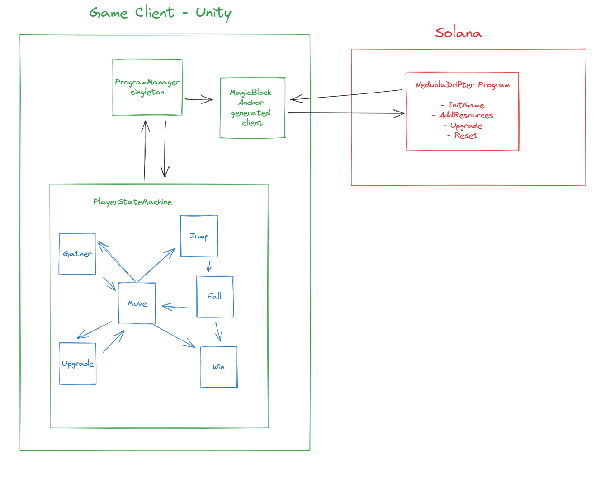

# Nebula Drifter

In Nebula Drifter you play as the space exploration robot, Zephyr. You have crash landed on an asteroid and can no longer fly! Use the resources on the asteroid to upgrade yourself and make your escape.

Play the game at: [https://kgilliam125.github.io/nebula-drifter/](https://kgilliam125.github.io/nebula-drifter/)

See the game in this [Demo Video](https://www.loom.com/share/99c0b69cf60d4dbc9712dc5e96b43fee?sid=db4434e2-43f0-4c1b-aa28-56812f05d0dc). Warning, spoilers!

# Testing Instructions

**Note**: Nebula Drifter is currently playable on Solana Devnet only! Mainnet SOL will not work as the progrom is not deployed to Mainnet.

## 1 - How to test

You can test the WebGL version of the game in the browser using at this link: https://kgilliam125.github.io/nebula-drifter/

Once you're in you should see a Main Menu that shows a Public Key. You can copy this with the "Copy" button to send a small amount of SOL to it.

You don't need much, sending 0.01 SOL is enough to play several times!

When Solana has confirmed the transfer you can click Start New Game. This can take some time to set up your account the first time. Once it finishes, the game should start. If it doesn't, just refresh and click Start New Game again. From here you can follow along with Zephyr to upgrade him and escape. Good luck, have fun!

You don't have to play in one session. Use the Continue button to pick up where you left off. If you want to start fresh, you can always click Start New Game again.

## 2 - Fitting the Upgrade theme

The core game loop is all about upgraded. You have to upgrade Zephyr, a small space exploration robot, after he mysteriously crash lands on an asteroid. Gather the resources to build your upgrades until you can fly again!

## 3 - Game Build

This game was built entirely from scratch during the Speedrun Game Jam, including most game assets except the below!

The in-game music and skybox are from Unity Asset Store asset packs.

## 4 - Solana Integration

Solana is used to store the upgrade status for Zephyr, as well as all resources in his inventory. The Solana program was created during the Speedrun Game Jam.

When he interacts with resources in the world, transactions are sent and confirmed which then update the client game state.

# Architecture Overview

